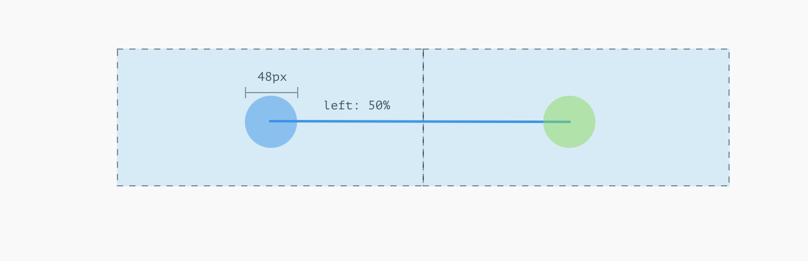
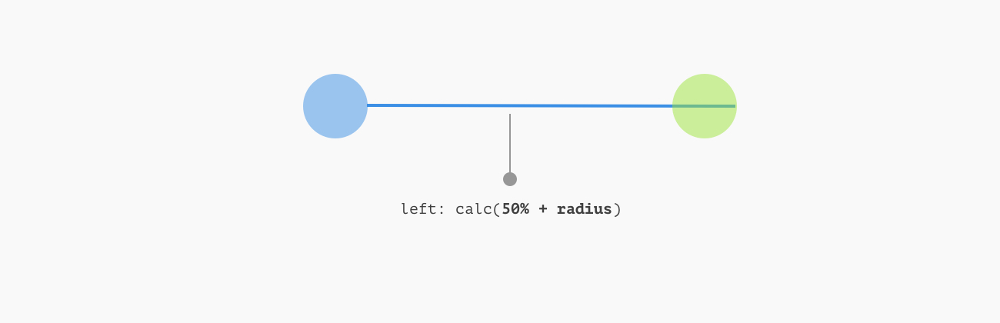
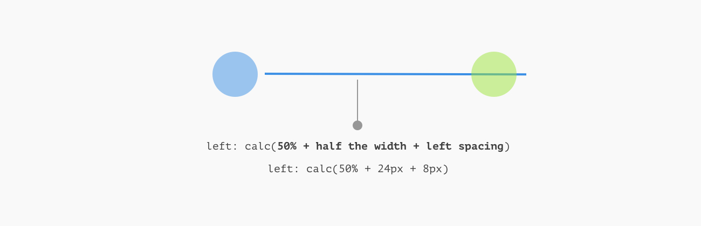
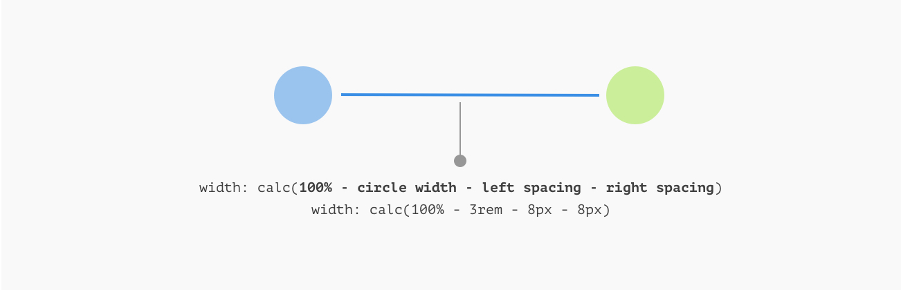
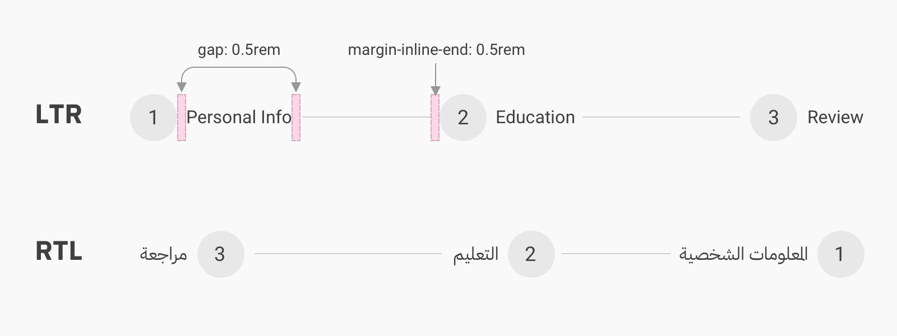
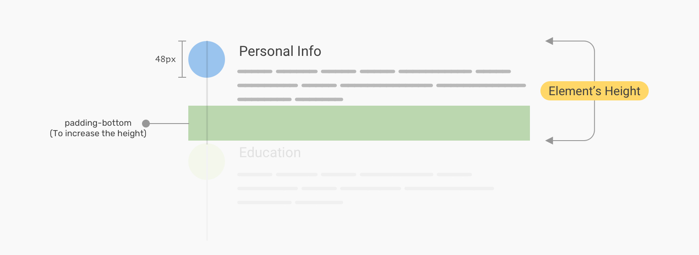

# Stepper

https://ishadeed.com/article/stepper-component-html-css/

## Horizontal Stepper: Example 1

For this example, we have a horizontal stepper with a line between the items. Here are the expectations for the stepper:

- Responsive
- Easy to be resized
- Magic numbers aren’t allowed
- Work with both light and dark modes

### Line Separator

You might wonder how the (:after) pseudo-element is taking the full width when it doesn’t actually have an explicit width? Well, it’s stretching to fill the full horizontal space because it’s a flex item.

First, we need to move it to the top. Since it’s a flex item, we can get the benefit of the order property.

```css
.c-stepper__item:not(:last-child):after {
  content: "";
  position: relative;
  top: 1.5rem;
  left: 50%;
  height: 2px;
  background-color: #e0e0e0;
  order: -1;
}
```

Here is an explanation of the above CSS:

- position: relative to control the line without removing it from the document flow.
- The top value is equal to half of the circle’s height.
- left: 50% to make the line starts from the center of the circle all the way to the center of the next item’s circle. This will allow us to color each line as per the progress if needed.


### A version where there is spacing before and after the line

We can either add a stroke around each circle with the same background underneath the items, or we can work a bit more with a better solution that works great for both dark and light modes.

Before diving into the solution, I want to show you that the separator lines we have are actually hidden under each circle. I reduced the opacity for the number circles so you can see them.


This is due to using left: 50% for the line



Since the line has left: 50%, it will start from the center of its parent. We use calc() to add the circle’s radius, this will make the separator line start from the end of the circle.


By adding the spacing we want (In this case it’s 8px) to the calc() function, we end up with a space on the left side of the separator line.



Finally, we need to create the spacing on the other side. The width is 100%, so we deduct the circle width along with the left and right spacing values.



To make it better, we can get the benefit of CSS variables so we can alter the size without manually editing the values.

```css
.c-stepper {
  --size: 3rem;
  --spacing: 0.5rem;
}

.c-stepper__item:not(:last-child):after {
  width: calc(100% - var(--size) - calc(var(--spacing) * 2));
  left: calc(50% + calc(var(--size) / 2 + var(--spacing)));
}
```

## Horizontal Stepper: Example 2


In this example, the separator line comes directly after the step title. The difference thing here is that the separator length varies based on the step title length.

Similar to the previous example, we’ll use flexbox to lay out the steps horizontally. Notice that we want to apply flex: 1 only to the first and second steps.

```css
.c-stepper {
  display: flex;
  flex-wrap: wrap;
}

.c-stepper__item {
  display: flex;
  align-items: center;
  gap: 0.5rem;
}

.c-stepper__item:not(:last-child) {
  flex: 1;
}

.c-stepper__item:before {
  --size: 3rem;
  content: "";
  display: block;
  flex: 0 0 var(--size);
  height: var(--size);
  border-radius: 50%;
}
```

The separator line will be added as a pseudo-element. It will have flex: 1 so it can fill the remaining space.
By using the gap on the .c-stepper\_\_item and the margin-inline-end logical property for the separator line, we can ensure that the component will work on both LTR and RTL documents.


## Vertical Stepper: Example 1

This is similar to the initial example, but the direction is vertical. I will use flexbox to layout the items.

To create a space between the separator line and the numbers, we can apply the same formula used in the horizontal stepper example or simply use top and bottom properties.


```css
.c-stepper {
  --size: 3rem;
  --spacing: 0.5rem;
}

.c-stepper__item:not(:last-child):after {
  top: calc(var(--size) + var(--spacing));
  transform: translateX(calc(var(--size) / 2));
  bottom: var(--spacing);
}
```
